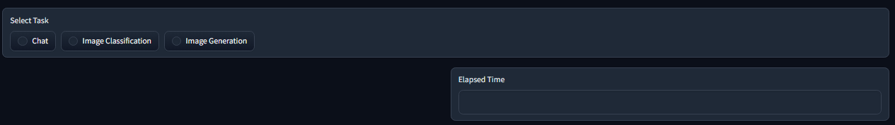
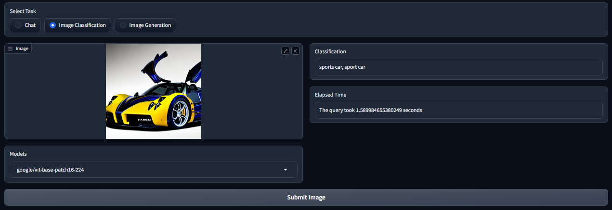

MultiHuggingGradio  
===================

MultiHuggingGradio was meticulously crafted to empower the development of web applications using the powerful synergy of Hugging Face and Gradio libraries. This dynamic package is designed to excel in multi-modality tasks, seamlessly handling challenges such as text generation and image classification.

To set up an environment capable of running this package smoothly, please follow the steps provided below. Our repository is intricately linked with GitHub Actions, which automates critical processes such as building, testing, and deployment. In the testing phase, we rely on the robust capabilities of pytest and pytest-cov to rigorously evaluate our tests and analyze their coverage, ensuring the utmost reliability and performance.


## 🎮 Interface Examples
This application boasts an exceptionally interactive interface, seamlessly adapting to different task modalities with intuitive ease.

**Getting Started:**

1. **Select Your Desired Task:**
   - Begin by choosing the task you wish to perform:

   

**Text Generation:**

2. **Text Generation Task:**
   - If you're interested in text generation, simply select the 'Chat' task and provide your prompt:

   

**Image Classification:**

3. **Image Classification Task:**
   - For image classification, opt for the 'Image Classification' task and submit the image you'd like to classify:

   

This streamlined interface makes switching between tasks an effortless process, ensuring a user-friendly experience for all your multi-modality needs.


## 📐 How to Install

CUDA_VERSION is machine dependent, in this installation version v11.6 (cu116) is installed, change depending on machine cuda version 
```shell
conda activate <your_env_name>

pip install -e multihugginggradio -f https://download.pytorch.org/whl/cu116/torch_stable.html
```

## 📈 Tests

Test files should start with prefix "test_" to become discoverable by pytest. --cov flag will also create a coverage information for the tests
Run tests with:
```shell
pytest --cov=multihugginggradio/multihugginggradio
```

## 🖇️ Documentation
*Insert Links to Coding guidelines, Pull Requests and review guidelines, dev workflow guidelines*

## ⚖️ LICENSE
MIT License

Copyright (c) 2023 Luís Ferreira

Permission is hereby granted, free of charge, to any person obtaining a copy
of this software and associated documentation files (the "Software"), to deal
in the Software without restriction, including without limitation the rights
to use, copy, modify, merge, publish, distribute, sublicense, and/or sell
copies of the Software, and to permit persons to whom the Software is
furnished to do so, subject to the following conditions:

The above copyright notice and this permission notice shall be included in all
copies or substantial portions of the Software.

THE SOFTWARE IS PROVIDED "AS IS", WITHOUT WARRANTY OF ANY KIND, EXPRESS OR
IMPLIED, INCLUDING BUT NOT LIMITED TO THE WARRANTIES OF MERCHANTABILITY,
FITNESS FOR A PARTICULAR PURPOSE AND NONINFRINGEMENT. IN NO EVENT SHALL THE
AUTHORS OR COPYRIGHT HOLDERS BE LIABLE FOR ANY CLAIM, DAMAGES OR OTHER
LIABILITY, WHETHER IN AN ACTION OF CONTRACT, TORT OR OTHERWISE, ARISING FROM,
OUT OF OR IN CONNECTION WITH THE SOFTWARE OR THE USE OR OTHER DEALINGS IN THE
SOFTWARE.
