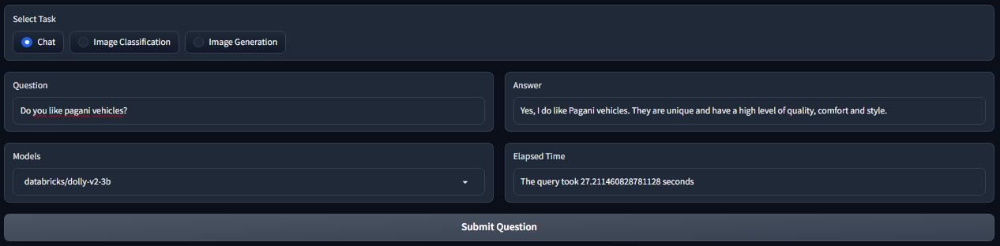

MultiHuggingGradio  
===================

MultiHuggingGradio was meticulously crafted to empower the development of web applications using the powerful synergy of Hugging Face and Gradio libraries. This dynamic package is designed to excel in multi-modality tasks, seamlessly handling challenges such as text generation, image generation and image classification.

To set up an environment capable of running this package smoothly, please follow the steps provided below. Our repository is intricately linked with GitHub Actions, which automates critical processes such as building, testing, and deployment. In the testing phase, we rely on the robust capabilities of pytest and pytest-cov to rigorously evaluate our tests and analyze their coverage, ensuring the utmost reliability and performance.


## 🎮 Interface Usage Examples
This application boasts an exceptionally interactive interface, seamlessly adapting to different task modalities with intuitive ease.

**Getting Started:**

1. **Select Your Desired Task:**
   - Begin by choosing the task you wish to perform:

   

2. **Text Generation Task:**
   - If you're interested in text generation, simply select the 'Chat' task and provide your prompt:

   

3. **Image Generation Task:**
   - If you're interested in image generation, simply select the 'Image Generation' task and provide your prompt:

   

4. **Image Classification Task:**
   - For image classification, opt for the 'Image Classification' task and submit the image you'd like to classify:

   

This streamlined interface makes switching between tasks an effortless process, ensuring a user-friendly experience for all your multi-modality needs.


## 📐 How to Install

CUDA_VERSION is machine dependent, in this installation version v11.6 (cu116) is installed, change depending on machine cuda version.
Note: environment needs to be version 3.8.16.
```shell
conda activate <your_env_name>

pip install -e multihugginggradio -f https://download.pytorch.org/whl/cu116/torch_stable.html
```

## 📈 Tests

Test files should start with prefix "test_" to become discoverable by pytest. --cov-report=html flag will create a coverage information in html form.
Run tests with:
```shell
pytest --cov=multihugginggradio/multihugginggradio --cov-report=html
```

## 🖇️ Documentation
*Insert Links to Coding guidelines, Pull Requests and review guidelines, dev workflow guidelines*

## ⚖️ LICENSE
MIT License